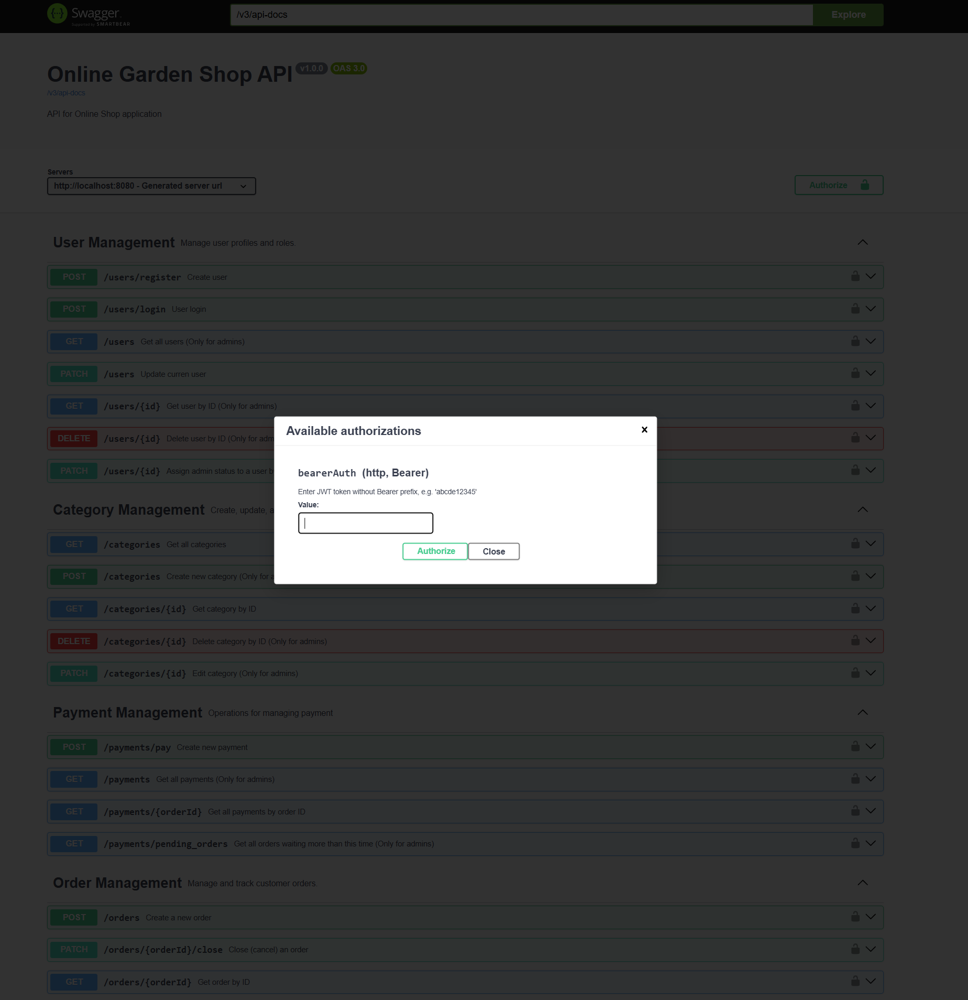

# Garden shop

---
## links :

- [technical task](https://docs.google.com/document/d/1Xn41eFhdYAJVYzRucsNwpbLJ5lNxdvpfx__SZf5DwXA/edit?tab=t.0)

- [layout](https://www.figma.com/design/SDNWLzCWkh9ZXdCpWEaByv/project-frontend?node-id=5251-7386&p=f)

- [rest api](https://confirmed-baron-2e5.notion.site/REST-API-f186cf63a46c4020b2237f73093922ab)

- [deploy](https://#)
---
## General description

### GardenShop is a modern web-based e-commerce application developed as a graduation project. It allows users to browse products, manage their shopping cart, place orders and mark items as favorites. The platform is tailored for parents and children, with a special focus on usability, performance, and clean architecture. It is built with Java and Spring Boot, featuring RESTful APIs, DTO-layer separation, PostgreSQL integration, and comprehensive exception handling.

***Key features include:***

- Full CRUD operations for users, products, categories, orders, carts and favorites

- Token-based user authentication and role management

- Clean architecture with separate layers (controller, service, repository, DTO, mapper)

- Swagger UI for API documentation and testing

- Modular and scalable structure prepared for future extensions (e.g., reviews, subscriptions, content section)

---

## Screenshot of the project's main page

---

## Main functionality of the project
- [x] User registration
- [x] User authentication
- [x] Editing a user profile
- [x] Deleting an account
- [x] Adding a new product
- [x] Editing a product
- [x] Deleting a product
- [x] Adding a new product category
- [x] Editing a product category
- [x] Deleting a product category
- [x] Getting a list of products
- [x] Getting detailed information about a product
- [x] Getting a list of product categories
- [x] Adding a product to the cart
- [x] Placing an order
- [x] Viewing the order status
- [x] User purchase history
- [x] Getting a list of the user's favorite products
- [x] Payment for goods
- [x] Payment for an order
- [x] Viewing payments
- [x] Adding to cart
- [x] Removing from cart
- [x] Viewing products in the cart
- [x] Orders reporting

---

## Stack of Technology

- Programming language: Java 17.
- Core framework: Spring Boot 2.x.
- Security: Spring Security.
- Data processing and mapping: Spring Data JPA/Hibernate.
- Core DBMS: PostgreSQL.
- Database connectivity: Used Spring Data to integrate with the
  database to provide simplified data handling and support for a database migration mechanism via Flyway or Liquibase
  for database schema versioning.
- Docker:  Creates containers for each
  component of the system, including the application, the database, and any other
  dependencies.

---

## Team Predators

### Team Members:
- [Kyra Subotovska]  (https://www.linkedin.com/in/kyra-subotovska/)
- [Yehor Karpov] (www.linkedin.com/in/yehor-karpov-961987373)

---

## Description of contribution to the project

--- 
### Kyra Subotovska
- Entity: ShopUser, Category, Order, OrderItem
- Test: ShopUser, Category, Order, OrderItem, Report
- SecurityConfiguration
- GlobalExceptionHandler
- Application-properties
- SwaggerConfiguration
- RestApi Description
- PostgreSQL
- Mapstruct
- Liquibase
- Scheduler

---
### Yehor Karpov
- Entity: Product, Favorite, Cart, CartItem, Payment
- Test: Product, Favorite, Cart, CartItem, Payment
- RestApi Description
- Application-properties
- GlobalExceptionHandler
- PostgreSQL
- Docker
- Mapstruct
- Jacoco